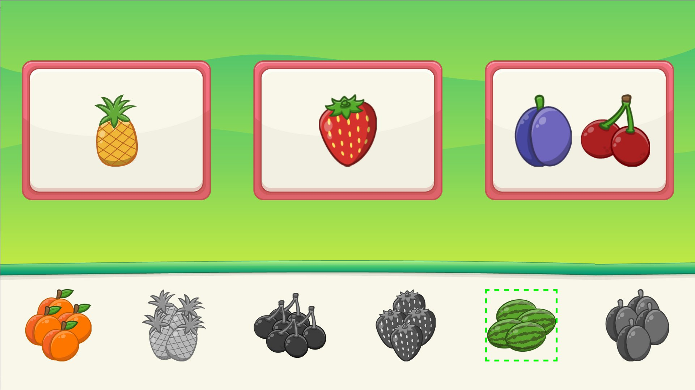

# Feladatleírás

Egy gyümölcspakolós minijáték elkészítését kérnénk tőled.
A feladatot html/js/css, tehát hagyományos frontend technológiákkal kell megvalósítani.
Bármilyen keretrendszer, task-manager, bundler, stb. használata megengedett, de nem elvárás.

Mellékelt zip fájlban találhatsz képeket, amiket fel kell használnod.

A feladat végzésénél nem kell törekedni reszponzivitásra, tervezd nyugodtan 1920x1080 (16:9)-es felbontásra, a mellékelt
assetek is így vannak elkészítve.

## Struktúra

A játék hátterét a `background.png` adja.

A képernyő alsó harmadában legyen egy képernyőnyi szélességű doboz (ez a *pool*), amiben a játék elindulásakor
mindig véletlenszerű sorrendben megjelenik `6` különféle gyümölcshalom a mellékelt 10-ből. A halmok grafikái a `*_group.png` fájlok.
A *pool* háttere a `pool.png`. A halom mérete 200x200, ehhez idomuljon a kép.

A felső kétharmadban foglaljon helyet, egymás mellett három konténer.
Egy konténer háttere a `screen.png`. Méretei: 523x387.
A konténerek egymás mellett, arányosan, középre igazítva foglaljanak helyet.

## Játék

Bármelyik halomra kattintva a halom kapjon `5px dashed #0f0` bordert. Ez a kijelölés jelzése.
Egyik halomról másikra kattintva a kijelölés áthelyeződik az újonnan kattintottra.

Ha van kijelölt halmunk és úgy kattintunk valamelyik felső konténerre, akkor kerüljön bele egy, a halomhoz tartozó gyümölcs.
Ezután a kijelölés törlődjön a halomról és inaktívvá válik és többé nem lehet kijelölni. Ezt jelöld úgy, hogy lejjebb veszed az opacitását,
vagy pedig rakj rá grayscale-t!

Egy konténerbe legfeljebb 2 gyümölcs kerülhet!

A játéknak akkor van vége, ha mindhárom konténerbe 2-2 gyümölcs kerül.

Ekkor rakj be egy teljes képernyő széles és magas elemet ezzel a háttérszínnel: `rgba(0, 0, 0, .5)`!
Ennek az elemnek a közepébe pedig helyezz el egy csillagot és használd ezt a képet: `star.svg`!

## Nehezítés

- plusz pont, ha sikerül megvalósítani, hogy konténerek között is lehessen átpakolni gyümölcsöket.
- plusz pont, ha animálod is az egyes eseményeket, fázisokat
- plusz pont, ha minél előbb kész vagy. :)

## Layout

Valahogy így kellene kinéznie:

